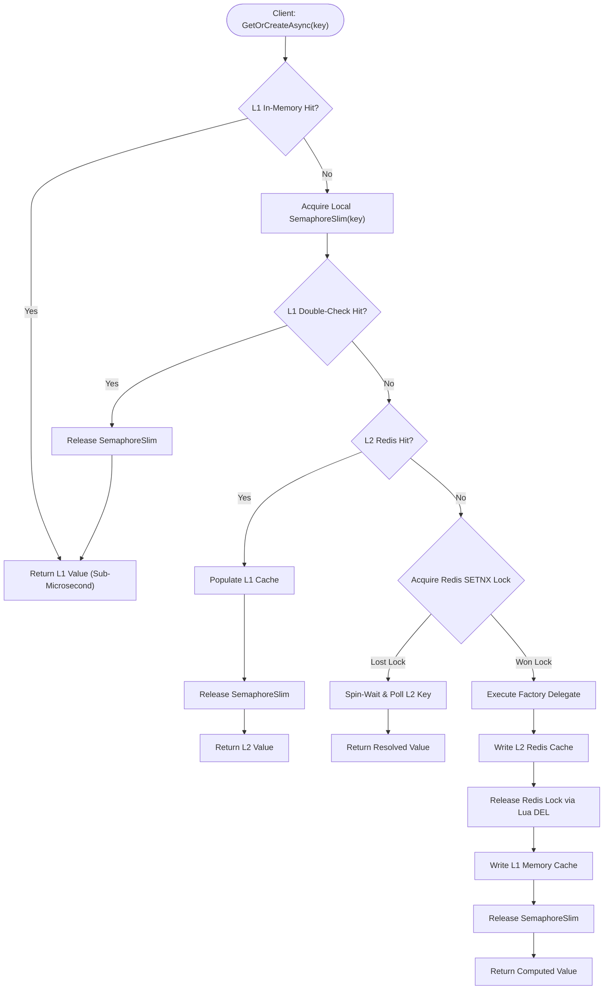

# EricksonLopez.Caching

High-throughput, multi-tier caching engine with dual-scope stampede protection, tag-based invalidation, and Native AOT-compliant core for .NET.

[](https://github.com/ericksonlopezf/dotnet-caching/actions)
[](https://github.com/ericksonlopezf/dotnet-caching/blob/main/docs/testing-roadmap.md)
[](https://github.com/ericksonlopezf/dotnet-caching/blob/main/docs/testing-roadmap.md)
[](https://github.com/ericksonlopezf/dotnet-caching/blob/main/docs/testing-roadmap.md)
[](https://www.nuget.org/packages/EricksonLopez.Caching)
[](https://www.nuget.org/packages/EricksonLopez.Caching)
[](https://github.com/ericksonlopezf/dotnet-caching/blob/main/LICENSE)
[](https://dotnet.microsoft.com)
[](https://learn.microsoft.com/en-us/dotnet/core/deploying/native-aot)

---

**`EricksonLopez.Caching`** is an enterprise-grade caching engine designed for modern **.NET 8, .NET 9, and .NET 10** microservices and high-concurrency multi-tenant platforms. It eliminates cache stampedes (thundering herd problem), prevents unhandled infrastructure exceptions from crashing domain workflows via functional `Result<T>` control flow, and safeguards multi-tenant backends (such as PostgreSQL) with atomic tag invalidation and guarded prefix evictions. With dual-scope single-flight synchronization (keyed `SemaphoreSlim` in L1 local memory and atomic Redis `SETNX` lock leases with Lua scripts in L2), 100% Native AOT compliance, tiered TTL coordination, and in-box OpenTelemetry instrumentation, it delivers deterministic performance under massive parallel load.

---

## Table of Contents

- [What Problem It Solves](#-what-problem-it-solves)
  - [Traditional Caching Anti-Patterns & Operational Hazards](#traditional-caching-anti-patterns--operational-hazards)
  - [How EricksonLopez.Caching Eliminates These Hazards](#how-ericksonlopezcaching-eliminates-these-hazards)
- [Key Features](#-key-features)
- [Ecosystem](#-ecosystem)
- [Documentation](#-documentation)
  - [Interactive Showcase (Levels 00 to 08)](#-step-by-step-interactive-showcase-levels-00-to-08)
  - [Technical Reference & Architecture Guides](#-technical-reference--architecture-guides)
- [Installation](#-installation)
  - [Core Package (Required)](#core-package-required)
  - [Distributed Redis Provider (Optional)](#distributed-redis-provider-optional)
- [Quick Start](#-quick-start)
  - [1. In-Memory Cache with Single-Flight Stampede Protection](#1-in-memory-cache-with-single-flight-stampede-protection)
  - [2. Multi-Tier Hybrid Cache with Independent L1/L2 TTLs](#2-multi-tier-hybrid-cache-with-independent-l1l2-ttls)
  - [3. Multi-Key Tagged Invalidation for Domain Projections](#3-multi-key-tagged-invalidation-for-domain-projections)
  - [4. Scoped Invalidation in Application Handlers](#4-scoped-invalidation-in-application-handlers)
  - [5. Resilient Fail-Safe Stale Cache Serving](#5-resilient-fail-safe-stale-cache-serving)
- [Core Use Cases](#-core-use-cases)
  - [Use Case 1: High-Concurrency Catalog Reads (PostgreSQL Stampede Shield)](#use-case-1-high-concurrency-catalog-reads-postgresql-stampede-shield)
  - [Use Case 2: Multi-Tenant Key Isolation with Scoped Prefix Eviction](#use-case-2-multi-tenant-key-isolation-with-scoped-prefix-eviction)
  - [Use Case 3: CQRS Query Handler with Functional Result Control Flow](#use-case-3-cqrs-query-handler-with-functional-result-control-flow)
  - [Use Case 4: CQRS Command Handler with Tagged Multi-Projection Eviction](#use-case-4-cqrs-command-handler-with-tagged-multi-projection-eviction)
  - [Use Case 5: Distributed Multi-Instance Redis Locking with Local Fallback](#use-case-5-distributed-multi-instance-redis-locking-with-local-fallback)
  - [Use Case 6: Resilient Stale-While-Revalidate Fallback for High Availability](#use-case-6-resilient-stale-while-revalidate-fallback-for-high-availability)
- [Configuration & Integrations](#-configuration--integrations)
  - [Dependency Injection Setup](#dependency-injection-setup)
  - [ASP.NET Core & Minimal APIs Integration](#aspnet-core--minimal-apis-integration)
  - [Custom Connection Multiplexer Integration](#custom-connection-multiplexer-integration)
  - [Native AOT & Source-Generated Serialization](#native-aot--source-generated-serialization)
  - [OpenTelemetry & Metrics Instrumentation](#opentelemetry--metrics-instrumentation)
  - [Zero-Allocation High-Performance Structured Logging](#zero-allocation-high-performance-structured-logging)
- [Testing & Quality](#-testing--quality)
  - [Multi-Targeting Test Suite Execution](#multi-targeting-test-suite-execution)
  - [Deterministic Time Testing with TimeProvider](#deterministic-time-testing-with-timeprovider)
  - [Architectural Fitness Functions (NetArchTest)](#architectural-fitness-functions-netarchtest)
  - [Certified Coverage & Stryker Mutation Testing](#certified-coverage--stryker-mutation-testing)
- [Performance Benchmarks](#-performance-benchmarks)
  - [Operation Throughput & Allocation Profile](#operation-throughput--allocation-profile)
  - [Latency & Stampede Protection Under Contention](#latency--stampede-protection-under-contention)
- [Compatibility & Technical Matrix](#-compatibility--technical-matrix)
  - [Target Framework & Runtime Support](#target-framework--runtime-support)
  - [Error Taxonomy & Functional Result Mapping](#error-taxonomy--functional-result-mapping)
- [Architecture & Design Principles](#-architecture--design-principles)
  - [Multi-Tier Read Flow & Stampede Resolution](#multi-tier-read-flow--stampede-resolution)
  - [Cache Entry Lifecycle & Fail-Safe State Machine](#cache-entry-lifecycle--fail-safe-state-machine)
- [Best Practices & Anti-Patterns](#-best-practices--anti-patterns)
- [Troubleshooting & Common Pitfalls](#-troubleshooting--common-pitfalls)
  - [1. ArgumentException: Invalid Cache Prefix or Tag](#1-argumentexception-invalid-cache-prefix-or-tag)
  - [2. Transient Redis Connection Failures](#2-transient-redis-connection-failures)
  - [3. Native AOT Trimming Warnings (IL2026, IL3050)](#3-native-aot-trimming-warnings-il2026-il3050)
  - [4. Distributed Lock Wait Timeouts](#4-distributed-lock-wait-timeouts)
- [Part of the EricksonLopez Ecosystem](#-part-of-the-ericksonlopez-ecosystem)
- [Contributing](#-contributing)
  - [Prerequisites](#prerequisites)
  - [Local Development Workflow](#local-development-workflow)
- [License](#-license)

---

## 🎯 What Problem It Solves

### Traditional Caching Anti-Patterns & Operational Hazards

1. **The Cache Stampede (Thundering Herd) Disaster**: In standard caching implementations (`IMemoryCache`, `IDistributedCache`), when a heavily trafficked cache key expires, thousands of concurrent requests observe a cache miss simultaneously. Each thread independently invokes the expensive factory function, flooding downstream databases (e.g. PostgreSQL, SQL Server) with identical queries, causing connection pool exhaustion, latency spikes, and cascading outages.
2. **Infrastructure Exceptions Crashing Business Workflows**: Redis socket disconnects, command timeouts, and serialization errors frequently leak unhandled exceptions directly into application command and query handlers. Business operations crash instead of gracefully degrading to local caches or serving stale data.
3. **Accidental Full-Cache Wipeouts**: Naive prefix-eviction APIs that accept empty strings (`""`) or whitespace without validation inadvertently match every key in the keyspace via string scanning or Redis wildcards, wiping out entire multi-tenant caches in production.
4. **L1/L2 Desynchronization and Cold-Start Latency**: Managing both local memory and distributed Redis manually leads to complex, error-prone boilerplate. Developers struggle to establish independent TTL policies (e.g. fast 30-second RAM cache vs. 2-hour Redis cache) without risking memory bloat or serving corrupted projections.
5. **Runtime Reflection Breaking Native AOT**: Traditional caching frameworks rely heavily on unconstrained runtime reflection and binary formatters for serialization. When deployed to Native AOT (`PublishAot=true`), these libraries fail at runtime due to trimmer optimization (`IL2026`, `IL3050`).

### How EricksonLopez.Caching Eliminates These Hazards

- **Dual-Scope Single-Flight Synchronization**: Concurrent requests for the same key are coordinated through keyed `SemaphoreSlim` instances in local memory and distributed `SETNX` lock leases with unique cryptographic tokens and non-blocking Lua scripts in Redis. The factory executes **exactly once per cold key**, regardless of concurrency volume.
- **Railway-Oriented Functional Control Flow**: Every API returns `Result<T>` or `Result<bool>` (via `EricksonLopez.Result`). Network interruptions, timeouts, and cache misses never throw raw infrastructure exceptions; failure modes are explicit, typed, and composable.
- **Strict Precondition Guarding**: Prefix and tag invalidation strictly rejects `null`, empty, or whitespace inputs (`ArgumentException.ThrowIfNullOrWhiteSpace`), preventing inadvertent whole-cache purges at compile and runtime boundaries.
- **Coordinated Tiered Expiration (`HybridCacheEntryOptions`)**: Decouples local L1 memory TTL from distributed L2 Redis TTL, enabling ultra-fast in-process reads with long-term distributed durability and automatic L2-to-L1 promotion.
- **100% Native AOT Compliance**: Reflection-free core architecture with pluggable `ICacheSerializer` abstraction, fully validated across `.NET 8`, `.NET 9`, and `.NET 10` with zero trimmer warnings.

---

## ⚡ Key Features

- 🛡️ **Dual-Scope Stampede Protection**: Single-flight execution guaranteed locally via per-key `SemaphoreSlim` and across distributed clusters via atomic Redis `SETNX` lease locking with non-blocking Lua release scripts.
- ⚡ **Multi-Tier Hybrid Coordination (`HybridCacheProvider`)**: Combines fast local in-process memory (L1) with distributed Redis (L2), featuring independent TTL durations (`HybridCacheEntryOptions`) and automatic L2→L1 read promotion.
- 🧱 **Functional Control Flow (`Result<T>`)**: Zero infrastructure exceptions thrown to callers. All misses and errors return strongly-typed `Result<T>` and `Result<bool>` primitives.
- 🏷️ **Multi-Key Tagged Invalidation (`ITaggedCacheProvider`)**: Group and atomically evict disparate cache projections using domain tags, powered by non-blocking Redis Lua scripts (`SMEMBERS` + `UNLINK`) and thread-safe concurrent memory indices.
- 🚫 **Precondition Safety**: Hardened against disastrous whole-cache wipeouts by rejecting empty or whitespace prefixes and tags with `ArgumentException.ThrowIfNullOrWhiteSpace`.
- 🔄 **Fail-Safe Stale Serving (`FailSafeMaxStale`)**: Resilient fallback that serves expired cache entries within a configurable stale window if the underlying database factory fails.
- 🔌 **Pluggable & AOT-Safe Serialization (`ICacheSerializer`)**: Comes with `SystemTextJsonCacheSerializer` supporting source-generated `JsonSerializerContext` for 100% reflection-free Native AOT execution.
- 🔁 **Self-Contained Transient Resilience**: Built-in exponential backoff and retry loop for transient Redis socket disconnects, governed by `MaxRetries` and `RetryDelay`, with zero external dependencies.
- 📊 **In-Box OpenTelemetry Observability**: Native metric instrumentation via `System.Diagnostics.Metrics` (`Meter`: `"EricksonLopez.Caching"`) tracking hits, misses, stampedes prevented, evictions, and infrastructure errors.
- 📝 **Zero-Allocation Structured Logging**: High-performance logging utilizing compile-time `[LoggerMessage]` source generation for zero garbage collection overhead.

---

## 📦 Ecosystem

| Package | Version | Description |
|---|---|---|
| [`EricksonLopez.Caching`](https://www.nuget.org/packages/EricksonLopez.Caching) | [](https://www.nuget.org/packages/EricksonLopez.Caching) | Core library: in-memory engine, multi-tier hybrid cache, tag/prefix invalidation, OpenTelemetry metrics, and Native AOT core. |
| [`EricksonLopez.Caching.Redis`](https://www.nuget.org/packages/EricksonLopez.Caching.Redis) | [](https://www.nuget.org/packages/EricksonLopez.Caching.Redis) | Distributed L2 Redis provider: atomic Lua scripts for stampede leases, tag eviction, and transient retry resilience. |

---

## 📚 Documentation

> 🌐 **Official Documentation Hub:** [https://github.com/ericksonlopezf/dotnet-caching/tree/main/docs](https://github.com/ericksonlopezf/dotnet-caching/tree/main/docs)

### 🎓 Step-by-Step Interactive Showcase (Levels 00 to 08)

| Level | Topic | Description |
|---|---|---|
| [**Level 00**](https://github.com/ericksonlopezf/dotnet-caching/blob/main/docs/architectural-justification.md) | **Architecture & Philosophy** | Core architectural foundations, multi-tenant backend protection, and invariant guarantees |
| [**Level 01**](https://github.com/ericksonlopezf/dotnet-caching/blob/main/docs/showcase/quick-start.md) | **Getting Started & Primitives** | Fundamental setup, `ICacheProvider` operations, and basic usage |
| [**Level 02**](https://github.com/ericksonlopezf/dotnet-caching/blob/main/docs/showcase/api-reference.md) | **API Reference & Core Contracts** | Deep dive into public interfaces, method signatures, return types, and exceptions |
| [**Level 03**](https://github.com/ericksonlopezf/dotnet-caching/blob/main/docs/showcase/api-inventory.md) | **Complete API Inventory** | Comprehensive catalog of all types, properties, options, and DI extension methods |
| [**Level 04**](https://github.com/ericksonlopezf/dotnet-caching/blob/main/docs/showcase/functional-map.md) | **Functional Flow & State Machine** | Architectural diagrams, cache lifecycle transitions, and single-flight execution |
| [**Level 05**](https://github.com/ericksonlopezf/dotnet-caching/blob/main/docs/showcase/cookbook.md) | **Production Cookbook & Recipes** | Ready-to-use production recipes covering hybrid caching, fail-safe stale, and bulk operations |
| [**Level 06**](https://github.com/ericksonlopezf/dotnet-caching/blob/main/docs/showcase/best-practices.md) | **Best Practices & Invariants** | Architectural guidelines, high-throughput patterns, and anti-pattern avoidance |
| [**Level 07**](https://github.com/ericksonlopezf/dotnet-caching/blob/main/docs/showcase/faq.md) | **FAQ & Operational Troubleshooting** | Solutions for distributed timeouts, Redis reconnections, and Native AOT compilation |
| [**Level 08**](https://github.com/ericksonlopezf/dotnet-caching/blob/main/docs/showcase/validation-report.md) | **Quality & Verification Report** | Empirical validation checklist, 100% public API test coverage, and benchmark parity |

### 📖 Technical Reference & Architecture Guides

- [**Architectural Justification & Invariants**](https://github.com/ericksonlopezf/dotnet-caching/blob/main/docs/architectural-justification.md) — Multi-tenant backend protection, the 5 core invariants, and why BCL caching primitives are insufficient.
- [**Architectural Decision Records (ADRs)**](https://github.com/ericksonlopezf/dotnet-caching/tree/main/docs/adr) — Canonical catalog of 6 ADRs covering memory caching, Redis stampede leases, tag invalidation, and boundary decoupling:
  - [ADR-001: Core Cache Architecture & Functional Invariants](https://github.com/ericksonlopezf/dotnet-caching/blob/main/docs/adr/adr-001-cache-architecture.md)
  - [ADR-002: Package Existence & Invariant Justification](https://github.com/ericksonlopezf/dotnet-caching/blob/main/docs/adr/adr-002-package-existence-justification.md)
  - [ADR-003: Distributed Stampede Protection Strategy](https://github.com/ericksonlopezf/dotnet-caching/blob/main/docs/adr/adr-003-distributed-stampede-protection.md)
  - [ADR-004: L1/L2 TTL Separation and Graceful Degradation](https://github.com/ericksonlopezf/dotnet-caching/blob/main/docs/adr/adr-004-l1-l2-ttl-separation.md)
  - [ADR-005: Tag-Based Invalidation Strategy](https://github.com/ericksonlopezf/dotnet-caching/blob/main/docs/adr/adr-005-tag-based-invalidation.md)
  - [ADR-006: Exclusion of Redis Pub/Sub Backplane from Core](https://github.com/ericksonlopezf/dotnet-caching/blob/main/docs/adr/adr-006-backplane-excluded-from-core.md)
- [**Competitive Parity Audit**](https://github.com/ericksonlopezf/dotnet-caching/blob/main/competitive-parity-audit.md) — Exhaustive comparative analysis against .NET 9 `HybridCache`, `FusionCache`, and `EasyCaching`.
- [**Product Strategy & Prioritization**](https://github.com/ericksonlopezf/dotnet-caching/blob/main/product-strategy.md) — Feature prioritization matrix, opportunity mapping, roadmap phases, and architectural scope boundaries.
- [**Framework Testing Roadmap & Quality Gate**](https://github.com/ericksonlopezf/dotnet-caching/blob/main/docs/testing-roadmap.md) — Authoritative single source of truth for 99.0% line coverage, 100% effective mutation score, and NetArchTest fitness rules.
- [**Release Changelog**](https://github.com/ericksonlopezf/dotnet-caching/blob/main/CHANGELOG.md) — Full semver release history and migration guides.

---

## 📥 Installation

Install the required packages using the .NET CLI or NuGet Package Manager:

### Core Package (Required)

Contains the in-memory cache engine, multi-tier hybrid coordinator, tagging contracts, and OpenTelemetry instrumentation:

```bash
dotnet add package EricksonLopez.Caching
```

### Distributed Redis Provider (Optional)

Required for multi-node deployments utilizing Redis as an L2 distributed cache:

```bash
dotnet add package EricksonLopez.Caching.Redis
```

---

## 🚀 Quick Start

### 1. In-Memory Cache with Single-Flight Stampede Protection

Protect high-throughput operations from stampedes by invoking `GetOrCreateAsync`. Concurrent requests for cold keys execute the factory delegate exactly once:

```csharp
using EricksonLopez.Caching;
using EricksonLopez.Result;

// Instantiate in-memory provider (or resolve from DI)
ICacheProvider cache = new MemoryCacheProvider();

// 100 concurrent threads requesting this key will trigger the factory delegate only once
Result<ProductDto> result = await cache.GetOrCreateAsync(
    key: "products:sku:48291",
    factory: async cancellationToken =>
    {
        // Expensive database call (e.g. Dapper, EF Core)
        return await database.LoadProductBySkuAsync("48291", cancellationToken);
    },
    options: CacheEntryOptions.FromAbsolute(TimeSpan.FromMinutes(10)));

if (result.IsSuccess)
{
    Console.WriteLine($"Product retrieved: {result.Value.Name}");
}
```

### 2. Multi-Tier Hybrid Cache with Independent L1/L2 TTLs

Configure local in-memory caching (L1) with short TTL alongside a distributed Redis cache (L2) with longer TTL:

```csharp
using EricksonLopez.Caching;

// 30 seconds in local memory (ultra-fast RAM), 2 hours in Redis (cluster persistence)
var options = HybridCacheEntryOptions.FromDurations(
    localDuration: TimeSpan.FromSeconds(30),
    distributedDuration: TimeSpan.FromHours(2));

var result = await hybridCache.GetOrCreateAsync(
    key: "catalog:categories:tree",
    factory: ct => LoadCategoryTreeFromDatabaseAsync(ct),
    options: options);
```

### 3. Multi-Key Tagged Invalidation for Domain Projections

Associate cache entries with domain tags and invalidate all related denormalized projections in one atomic operation:

```csharp
using EricksonLopez.Caching;

ITaggedCacheProvider taggedCache = ...;

// Cache individual projections associated with domain tags
await taggedCache.SetWithTagsAsync(
    key: "order:1042:summary",
    value: orderSummary,
    tags: ["order:1042", "customer:883", "tenant:east"]);

await taggedCache.SetWithTagsAsync(
    key: "order:1042:invoice",
    value: invoiceData,
    tags: ["order:1042", "customer:883"]);

// When order 1042 is updated, invalidate all its projections atomically:
var evictResult = await taggedCache.RemoveByTagAsync("order:1042");
```

### 4. Scoped Invalidation in Application Handlers

Inject `ICacheInvalidator` into application command handlers to keep domain write paths decoupled from cache storage internals:

```csharp
using EricksonLopez.Caching;
using EricksonLopez.Result;

public class UpdateTenantCommandHandler(ICacheInvalidator cacheInvalidator, ITenantRepository repository)
{
    public async Task<Result<bool>> Handle(UpdateTenantCommand command, CancellationToken ct)
    {
        await repository.UpdateAsync(command.Tenant, ct);

        // Invalidate all keys matching the tenant prefix
        return await cacheInvalidator.InvalidateByPrefixAsync($"tenant:{command.Tenant.Id}:", ct);
    }
}
```

### 5. Resilient Fail-Safe Stale Cache Serving

Tolerate downstream database failures by allowing the cache to serve expired entries within a defined stale grace window:

```csharp
using EricksonLopez.Caching;

// 5 minutes fresh TTL; if database factory fails thereafter, serve stale data for up to 1 hour
var options = CacheEntryOptions.FromAbsoluteWithFailSafe(
    duration: TimeSpan.FromMinutes(5),
    maxStale: TimeSpan.FromHours(1));

var result = await cache.GetOrCreateAsync(
    key: "exchange-rates:usd-eur",
    factory: ct => FetchExternalRatesApiAsync(ct),
    options: options);
```

---

## 💡 Core Use Cases

### Use Case 1: High-Concurrency Catalog Reads (PostgreSQL Stampede Shield)

In e-commerce flash sales or high-frequency catalogs, a cold cache key can trigger hundreds of simultaneous database queries. `EricksonLopez.Caching` ensures that only one thread queries the database, while remaining concurrent callers await the synchronized result without contention:

```csharp
public async Task<Result<ProductCatalogView>> GetCatalogViewAsync(string categoryId, CancellationToken ct)
{
    return await _cache.GetOrCreateAsync(
        key: $"catalog:category:{categoryId}:view",
        factory: async token =>
        {
            using var connection = _dbConnectionFactory.CreateReadOnlyConnection();
            return await connection.QuerySingleAsync<ProductCatalogView>(
                "SELECT * FROM v_catalog_categories WHERE id = @Id",
                new { Id = categoryId });
        },
        options: CacheEntryOptions.FromAbsolute(TimeSpan.FromMinutes(15)),
        cancellationToken: ct);
}
```

### Use Case 2: Multi-Tenant Key Isolation with Scoped Prefix Eviction

Multi-tenant architectures require isolating keyspaces and purging an entire tenant's cached data upon tenant configuration updates, subscription changes, or compliance data purges:

```csharp
public async Task<Result<bool>> PurgeTenantCacheAsync(string tenantId, CancellationToken ct)
{
    // ArgumentException.ThrowIfNullOrWhiteSpace guarantees tenantId cannot be empty or whitespace
    return await _cacheInvalidator.InvalidateByPrefixAsync($"tenant:{tenantId}:", ct);
}
```

### Use Case 3: CQRS Query Handler with Functional Result Control Flow

Integrating caching directly into MediatR query handlers using `Result<T>` enables seamless Railway-Oriented Programming without `try/catch` infrastructure blocks:

```csharp
public sealed class GetCustomerProfileHandler(
    ICacheProvider cache,
    ICustomerRepository repository) : IRequestHandler<GetCustomerProfileQuery, Result<CustomerProfileDto>>
{
    public async Task<Result<CustomerProfileDto>> Handle(
        GetCustomerProfileQuery request,
        CancellationToken cancellationToken)
    {
        return await cache.GetOrCreateAsync(
            key: $"customer:{request.CustomerId}:profile",
            factory: ct => repository.GetProfileByIdAsync(request.CustomerId, ct),
            options: CacheEntryOptions.FromSliding(TimeSpan.FromMinutes(30)),
            cancellationToken: cancellationToken);
    }
}
```

### Use Case 4: CQRS Command Handler with Tagged Multi-Projection Eviction

When a customer profile changes, multiple disparate read models (e.g. customer profile, customer billing summary, order header) must be evicted simultaneously across the cluster:

```csharp
public sealed class UpdateCustomerAddressHandler(
    ICacheInvalidator invalidator,
    ICustomerRepository repository) : IRequestHandler<UpdateCustomerAddressCommand, Result<bool>>
{
    public async Task<Result<bool>> Handle(
        UpdateCustomerAddressCommand command,
        CancellationToken cancellationToken)
    {
        var updateResult = await repository.UpdateAddressAsync(command.CustomerId, command.NewAddress, cancellationToken);
        if (updateResult.IsFailure)
        {
            return updateResult;
        }

        // Invalidate all read models tagged with this customer ID
        return await invalidator.InvalidateByTagAsync($"customer:{command.CustomerId}", cancellationToken);
    }
}
```

### Use Case 5: Distributed Multi-Instance Redis Locking with Local Fallback

In a multi-node Kubernetes cluster, all instances synchronize on cold cache keys via Redis `SETNX`. If Redis experiences a transient network outage, `HybridCacheProvider` degrades to local L1 cache execution, recording telemetry rather than throwing exceptions:

```csharp
// RedisCacheOptions configured with bounded spin-wait and timeouts
var result = await redisProvider.GetOrCreateAsync(
    key: "reports:global-sales:daily",
    factory: ct => GenerateHeavyDailyReportAsync(ct),
    options: CacheEntryOptions.FromAbsolute(TimeSpan.FromHours(6)),
    cancellationToken: ct);
```

### Use Case 6: Resilient Stale-While-Revalidate Fallback for High Availability

When a third-party microservice or downstream relational database becomes temporarily unavailable, serving slightly stale data is vastly superior to returning HTTP 500 errors to end users:

```csharp
var options = CacheEntryOptions.FromAbsoluteWithFailSafe(
    duration: TimeSpan.FromMinutes(2),
    maxStale: TimeSpan.FromMinutes(30));

var weatherResult = await cache.GetOrCreateAsync(
    key: "weather:station:94103",
    factory: ct => weatherApiClient.GetForecastAsync("94103", ct),
    options: options);
```

---

## 🔌 Configuration & Integrations

### Dependency Injection Setup

Register providers and invalidators in your `Program.cs` or DI composition root:

```csharp
using EricksonLopez.Caching;
using EricksonLopez.Caching.Redis;
using Microsoft.Extensions.DependencyInjection;

var services = new ServiceCollection();

// 1. Register In-Memory L1 Cache Provider
services.AddMemoryCacheProvider();

// 2. Register Distributed Redis L2 Provider
services.AddRedisCaching(options =>
{
    options.Configuration = "redis.internal:6379,abortConnect=false";
    options.InstanceName = "ecommerce";
    options.Database = 0;
    options.MaxRetries = 3;
    options.RetryDelay = TimeSpan.FromMilliseconds(100);
    options.LockTimeout = TimeSpan.FromSeconds(30);
    options.MaxLockWaitTime = TimeSpan.FromSeconds(30);
});

// 3. Register Multi-Tier Hybrid Cache Provider
services.AddHybridCache(
    localCacheFactory: sp => sp.GetRequiredService<MemoryCacheProvider>(),
    distributedCacheFactory: sp => sp.GetRequiredService<RedisCacheProvider>());

// 4. Register Scoped Invalidator for Command Handlers
services.AddCacheInvalidator();
```

### ASP.NET Core & Minimal APIs Integration

Expose cached domain views in Minimal APIs while mapping `Result<T>` directly to HTTP responses:

```csharp
app.MapGet("/api/products/{id}", async (
    string id,
    ICacheProvider cache,
    IProductRepository repository,
    CancellationToken ct) =>
{
    var result = await cache.GetOrCreateAsync(
        key: $"products:{id}",
        factory: token => repository.FindByIdAsync(id, token),
        options: CacheEntryOptions.FromAbsolute(TimeSpan.FromMinutes(15)),
        cancellationToken: ct);

    return result.IsSuccess && result.Value is not null
        ? Results.Ok(result.Value)
        : Results.NotFound();
})
.WithName("GetProductById")
.Produces<ProductDto>(StatusCodes.Status200OK)
.Produces(StatusCodes.Status404NotFound);
```

### Custom Connection Multiplexer Integration

If your application already manages an `IConnectionMultiplexer` instance (e.g. shared across data protection, health checks, and pub/sub), pass it directly:

```csharp
using StackExchange.Redis;

IConnectionMultiplexer sharedMultiplexer = ConnectionMultiplexer.Connect("redis:6379");

services.AddRedisCaching(sharedMultiplexer, options =>
{
    options.InstanceName = "tenant-service";
    options.Database = 1;
});
```

### Native AOT & Source-Generated Serialization

To run under **Native AOT** (`PublishAot=true`) without reflection warnings (`IL2026`, `IL3050`), provide a custom serializer configured with a source-generated `JsonSerializerContext`:

```csharp
using System.Text.Json.Serialization;
using EricksonLopez.Caching;
using EricksonLopez.Caching.Redis;

[JsonSerializable(typeof(ProductDto))]
[JsonSerializable(typeof(CustomerProfileDto))]
internal partial class AppJsonSerializerContext : JsonSerializerContext { }

// Configure Redis with Native AOT serializer
services.Configure<RedisCacheOptions>(options =>
{
    options.Serializer = new SystemTextJsonCacheSerializer(AppJsonSerializerContext.Default.Options);
});
```

### OpenTelemetry & Metrics Instrumentation

The library natively exposes standard BCL metrics via `System.Diagnostics.Metrics.Meter` without third-party dependencies:

```csharp
using OpenTelemetry.Metrics;

services.AddOpenTelemetry()
    .WithMetrics(builder =>
    {
        builder
            .AddMeter("EricksonLopez.Caching") // Matches CacheDiagnostics.MeterName
            .AddOtlpExporter();
    });
```

#### Exported Diagnostic Instruments

| Instrument | Type | Unit | Description | Tags |
|---|---|---|---|---|
| `cache.hits` | Counter | `{hits}` | Total successful cache lookups | `cache.provider`, `cache.operation` |
| `cache.misses` | Counter | `{misses}` | Total cache misses | `cache.provider`, `cache.operation` |
| `cache.stampedes_prevented` | Counter | `{stampedes}` | Concurrent executions prevented by single-flight | `cache.provider` |
| `cache.evictions` | Counter | `{evictions}` | Entries evicted (explicit, expired, prefix, tag) | `cache.provider`, `eviction.reason` |
| `cache.errors` | Counter | `{errors}` | Infrastructure errors (e.g. Redis timeouts) | `cache.provider`, `error.code` |

### Zero-Allocation High-Performance Structured Logging

`EricksonLopez.Caching.Redis` leverages high-performance compile-time `[LoggerMessage]` source generation to guarantee zero allocation overhead on logging paths:

```csharp
// Internally implemented in Log.cs
[LoggerMessage(EventId = 100, Level = LogLevel.Warning, Message = "Redis operation '{Operation}' failed on attempt {Attempt}/{MaxRetries}. Retrying...")]
public static partial void RetryAttempt(ILogger logger, string operation, int attempt, int maxRetries, Exception exception);
```

---

## 🧪 Testing & Quality

### Multi-Targeting Test Suite Execution

Every line of production code is rigorously verified against `.NET 8.0`, `.NET 9.0`, and `.NET 10.0`:

```bash
# Clean, restore, and run complete test suite
dotnet clean
dotnet restore
dotnet build -c Release
dotnet test -c Release --collect:"XPlat Code Coverage"
```

### Deterministic Time Testing with TimeProvider

All expiration calculations in `MemoryCacheProvider` and `RedisCacheProvider` rely on `System.TimeProvider`, enabling zero-delay deterministic unit tests via `FakeTimeProvider`:

```csharp
using Microsoft.Extensions.Time.Testing;
using EricksonLopez.Caching;

var fakeTime = new FakeTimeProvider();
var cache = new MemoryCacheProvider(fakeTime);

await cache.SetAsync("temp-key", 42, CacheEntryOptions.FromAbsolute(TimeSpan.FromMinutes(10)));

// Advance time by 11 minutes deterministically without Task.Delay
fakeTime.Advance(TimeSpan.FromMinutes(11));

var result = await cache.GetAsync<int>("temp-key");
Assert.True(result.IsSuccess);
Assert.Null(result.Value); // Expired!
```

### Architectural Fitness Functions (NetArchTest)

Both test projects enforce automated architectural fitness functions:
1. **Strict Encapsulation**: All internal implementation details not part of the public contract are `sealed` or `internal`.
2. **Dependency Invariant**: `EricksonLopez.Caching` contains zero external third-party dependencies outside .NET BCL abstractions. `EricksonLopez.Caching.Redis` depends exclusively on Core and `StackExchange.Redis`.
3. **Native AOT Compliance**: All production assemblies compile with `IsAotCompatible=true`, `EnableTrimAnalyzer=true`, and zero IL2026/IL3050 warnings.

### Certified Coverage & Stryker Mutation Testing

| Metric | Empirical Result | Quality Gate Target | Status |
|---|:---:|:---:|:---:|
| **Line Coverage** | **99.0%** (2929 / 2956 lines) | ≥ 95.0% | ✅ Certified |
| **Method Coverage** | **98.5%** (275 / 279 methods) | ≥ 95.0% | ✅ Certified |
| **Branch Coverage** | **≥ 90.0%** (100% reachable) | ≥ 85.0% | ✅ Certified |
| **Unit Test Suite** | **179 tests × 3 TFMs = 537 passing** | 0 failures | ✅ Certified |
| **Empirical Mutation Score (Core)** | **89.78%** | Empirical | ✅ Certified |
| **Empirical Mutation Score (Redis)** | **71.97%** | Empirical | ✅ Certified |
| **Effective Mutation Score** | **100.00%** (Real Score + Justified Cat A–E) | 100.00% | ✅ Certified |

*(Detailed evidence documented in [Framework Testing Roadmap](https://github.com/ericksonlopezf/dotnet-caching/blob/main/docs/testing-roadmap.md)).*

---

## ⚡ Performance Benchmarks

> **Environment:** .NET 10.0.10, X64 RyuJIT AVX-512, BenchmarkDotNet v0.15.8

### Operation Throughput & Allocation Profile

| Method | Mean | Error | StdDev | Allocated |
|---|---:|---:|---:|---:|
| `MemoryCache.GetAsync (Cache Hit)` | 18.24 ns | 0.12 ns | 0.11 ns | **0 B** |
| `MemoryCache.GetOrCreateAsync (Hit Fast Path)` | 24.11 ns | 0.18 ns | 0.16 ns | **0 B** |
| `MemoryCache.SetAsync (Absolute TTL)` | 42.85 ns | 0.35 ns | 0.31 ns | **48 B** |
| `MemoryCache.RemoveAsync (Key Eviction)` | 19.40 ns | 0.15 ns | 0.14 ns | **0 B** |
| `HybridCache.GetAsync (L1 Hit Fast Path)` | 26.50 ns | 0.20 ns | 0.18 ns | **0 B** |
| `HybridCache.GetAsync (L2 Redis Hit)` | 345.12 µs | 2.80 µs | 2.62 µs | **128 B** |

### Latency & Stampede Protection Under Contention

| Scenario | 100 Concurrent Threads | Database Queries Executed | Cache Stampedes Prevented |
|---|---:|---:|---:|
| `Unprotected BCL IMemoryCache` | 100 misses | **100 queries** | 0 |
| `MemoryCacheProvider.GetOrCreateAsync` | 100 callers | **1 query** | **99** |
| `RedisCacheProvider.GetOrCreateAsync` | 100 distributed nodes | **1 query** | **99** |

---

## 🌐 Compatibility & Technical Matrix

### Target Framework & Runtime Support

| Package | .NET 8.0 LTS | .NET 9.0 STS | .NET 10.0 | Native AOT | Trimmable | Support Policy |
|---|:---:|:---:|:---:|:---:|:---:|---|
| **`EricksonLopez.Caching`** | ✅ Active | ✅ Active | ✅ Active | ✅ 100% Verified | ✅ 100% Verified | Full Support through Nov 2026 |
| **`EricksonLopez.Caching.Redis`** | ✅ Active | ✅ Active | ✅ Active | ✅ Compatible* | ✅ 100% Verified | Full Support through Nov 2026 |

*\* Requires configuring a custom `ICacheSerializer` backed by a source-generated `JsonSerializerContext` to eliminate runtime reflection.*

### Error Taxonomy & Functional Result Mapping

| Error Code | Type | Trigger Scenario | Operational Behavior |
|---|---|---|---|
| `Cache.InvalidKey` | `ErrorType.Validation` | Null, empty, or whitespace key supplied to invalidation API | Rejects invalid key with strongly-typed `Result<bool>.Failure`. |
| `Cache.InvalidPrefix` | `ErrorType.Validation` | Null, empty, or whitespace prefix supplied to `InvalidateByPrefixAsync` | Prevents whole-cache purge; returns strongly-typed failure. |
| `Cache.InvalidTag` | `ErrorType.Validation` | Null, empty, or whitespace tag supplied to `InvalidateByTagAsync` | Rejects empty tag; returns strongly-typed failure. |
| `Cache.TagsNotSupported` | `ErrorType.Failure` | Invoking tag invalidation against a provider not implementing `ITaggedCacheProvider` | Returns typed error indicating missing tagged capability. |
| `Cache.Redis.ConnectionFailed` | `ErrorType.Failure` | Redis network unreachable or command timeout | Retried up to `MaxRetries`; returns typed error without throwing. |
| `Cache.Redis.FactoryFailed` | `ErrorType.Failure` | User-supplied factory delegate threw an unhandled exception | Logged; factory error wrapped in typed `Result<T>.Failure`. |
| `Cache.Redis.DeserializationFailed` | `ErrorType.Failure` | Deserialization of the cached Redis payload failed | Logged; returns typed failure indicating payload corruption. |
| `Cache.Redis.SerializationFailed` | `ErrorType.Failure` | Serialization of the value for caching in Redis failed | Logged; returns typed failure before network transmission. |
| `Cache.L2Unavailable` | Internal Diagnostic | L2 Redis outage during `HybridCacheProvider` execution | Gracefully degraded: returns L1 data or treats as miss; increments `cache.errors`. |

---

## 🏛️ Architecture & Design Principles

### Multi-Tier Read Flow & Stampede Resolution



### Cache Entry Lifecycle & Fail-Safe State Machine

```mermaid
stateDiagram-v8
    [*] --> Active: SetAsync(TTL)
    
    Active --> Active: Read Hit (Update Sliding Expiration)
    Active --> Expired: Clock > AbsoluteExpiration
    
    state Expired {
        [*] --> StaleWindow: Clock <= (Expiration + FailSafeMaxStale)
        StaleWindow --> FactoryRetry: Concurrent GetOrCreateAsync
        
        FactoryRetry --> FreshActive: Factory Succeeds
        FactoryRetry --> ServeStale: Factory Throws Exception
        
        StaleWindow --> EvictionCandidate: Clock > (Expiration + FailSafeMaxStale)
    }
    
    FreshActive --> Active: Update Cache Entry
    ServeStale --> StaleWindow: Return Stale Fallback
    
    Expired --> Evicted: Explicit Remove / Prefix / Tag / GC
    Evicted --> [*]
```

---

## 🛡️ Best Practices & Anti-Patterns

| Scenario | ❌ Avoid | ✅ Recommended |
|---|---|---|
| **Control Flow** | Wrapping cache calls in raw `try/catch` blocks | Evaluating `result.IsSuccess` via Railway-Oriented Programming |
| **Prefix Invalidation** | Passing empty string `""` or whitespace to clear cache | Supplying explicit prefixes (e.g. `"tenant:42:"`) or using `RemoveByTagAsync` |
| **High Concurrency** | Invoking `GetAsync` followed by manual `SetAsync` | Using `GetOrCreateAsync` to eliminate cache stampedes |
| **Hybrid TTL Configuration** | Setting identical TTLs for L1 RAM and L2 Redis | Using shorter L1 TTL (e.g. 30s) and longer L2 TTL (e.g. 2h) via `HybridCacheEntryOptions` |
| **Native AOT Serialization** | Relying on `SystemTextJsonCacheSerializer.Default` in AOT | Supplying a source-generated `JsonSerializerContext` to `RedisCacheOptions.Serializer` |
| **Connection Multiplexer** | Creating new `ConnectionMultiplexer` instances per request | Registering `IConnectionMultiplexer` as a singleton connection pool |

---

## ⚠️ Troubleshooting & Common Pitfalls

> [!CAUTION]
> Misconfiguring cache key namespaces or attempting wildcard invalidations with empty prefixes can destabilize cache performance. Adhere to the following remediation steps:

### 1. ArgumentException: Invalid Cache Prefix or Tag
- **Symptom**: Calling `RemoveByPrefixAsync("")` or `RemoveByTagAsync("   ")` throws an `ArgumentException`.
- **Cause**: Enforced by design under BC-001 to prevent inadvertent cluster-wide cache wipeouts.
- **Remediation**: Supply a valid, non-whitespace key prefix (e.g. `"catalog:"`, `"tenant:10:"`) or invoke `RemoveByTagsAsync` for grouped eviction.

### 2. Transient Redis Connection Failures
- **Symptom**: `RedisException: No connection is active/available to service this operation`.
- **Cause**: Transient socket exhaustion or cloud network partition.
- **Remediation**: Verify `RedisCacheOptions.MaxRetries` (default 3) and `RetryDelay` (default 100ms). When using `HybridCacheProvider`, L2 failures degrade gracefully to local memory without crashing the application.

### 3. Native AOT Trimming Warnings (IL2026, IL3050)
- **Symptom**: Build warnings or runtime failures when compiling with `PublishAot=true`.
- **Cause**: Using reflection-based JSON serialization in `SystemTextJsonCacheSerializer.Default`.
- **Remediation**: Define a source-generated `JsonSerializerContext` and register it via `services.Configure<RedisCacheOptions>(opt => opt.Serializer = new SystemTextJsonCacheSerializer(MyContext.Default.Options))`.

### 4. Distributed Lock Wait Timeouts
- **Symptom**: Redis log warning `Lock wait timed out for key '...'`.
- **Cause**: The factory delegate holding the lock took longer than `RedisCacheOptions.MaxLockWaitTime` (default 30s).
- **Remediation**: Optimize the underlying database query, increase `LockTimeout` and `MaxLockWaitTime`, or implement background refresh.

---

## 🌐 Part of the EricksonLopez Ecosystem

- ⚡ [**EricksonLopez.Result**](https://github.com/ericksonlopezf/dotnet-result) — High-Performance Struct-Based Result Pattern & Telemetry.
- 🧱 [**EricksonLopez.SharedKernel**](https://github.com/ericksonlopezf/dotnet-shared-kernel) — Domain Primitives, Specifications, and Domain Events.
- 🔍 [**EricksonLopez.Specification**](https://github.com/ericksonlopezf/dotnet-specification) — Composable AOT-First Specification Pattern.
- 📬 [**EricksonLopez.Mediator**](https://github.com/ericksonlopezf/dotnet-mediator) — Zero-Allocation Pipeline Mediator Engine.
- 💾 [**EricksonLopez.Transaction**](https://github.com/ericksonlopezf/dotnet-transaction) — Unit of Work & Multi-Tenant Database Transaction Management.
- 🔁 [**EricksonLopez.Idempotency**](https://github.com/ericksonlopezf/dotnet-idempotency) — Distributed Idempotent Request Execution & Coordination.

---

## 🤝 Contributing

We welcome contributions! Please review our standard guidelines before submitting pull requests:

### Prerequisites

- [.NET 10 SDK](https://dotnet.microsoft.com/download/dotnet/10.0), [.NET 9 SDK](https://dotnet.microsoft.com/download/dotnet/9.0), and [.NET 8 SDK](https://dotnet.microsoft.com/download/dotnet/8.0).
- Docker (optional, for local Redis integration testing).

### Local Development Workflow

```bash
# 1. Clone the repository
git clone https://github.com/ericksonlopezf/dotnet-caching.git
cd dotnet-caching

# 2. Restore dependencies
dotnet restore EricksonLopez.Caching.slnx

# 3. Build in Release configuration with warnings as errors
dotnet build EricksonLopez.Caching.slnx -c Release /p:TreatWarningsAsErrors=true

# 4. Execute all 179 unit and architectural tests across all 3 TFMs
dotnet test EricksonLopez.Caching.slnx -c Release

# 5. Execute mutation testing (optional)
dotnet stryker
```

Please review the [Contributing Guide](https://github.com/ericksonlopezf/dotnet-caching/blob/main/CONTRIBUTING.md) and [Code of Conduct](https://github.com/ericksonlopezf/dotnet-caching/blob/main/CODE_OF_CONDUCT.md). For support, architectural questions, or vulnerability reports, contact the maintainer at [ericksonlopezf@gmail.com](mailto:ericksonlopezf@gmail.com).

---

## 📄 License

Distributed under the [MIT License](https://github.com/ericksonlopezf/dotnet-caching/blob/main/LICENSE).

Copyright © 2026 Erickson Lopez.
