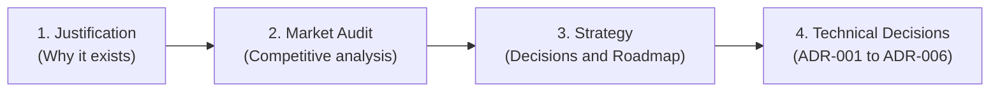

# Architecture and Documentation: EricksonLopez.Caching

Welcome to the official architectural documentation for **`EricksonLopez.Caching`**. This document defines the recommended **Sequential Reading Order** to understand the design, strategic motivations, and technical decisions of the library.

---

## 1. Sequential Reading Order

To assimilate the architecture without conceptual gaps, follow this 4-stage sequence:



### Stage 1: Architectural Foundations
* 📄 **[Architectural Justification](./architectural-justification.md)**:
  * Understand why Microsoft's `IMemoryCache` and `IDistributedCache` are insufficient for multitenant systems.
  * Learn the 5 core invariants and the *"Invariant-First"* philosophy.

### Stage 2: Competitive Diagnosis
* 📄 **[Competitive Parity Audit](../competitive-parity-audit.md)**:
  * Comprehensive comparative analysis against `HybridCache` (.NET 9), `FusionCache`, `EasyCaching`, and `IMemoryCache`.
  * Identification of genuine strengths, false parities, and resolved latent vulnerabilities.

### Stage 3: Product Strategy & Prioritization
* 📄 **[Product Strategy](../product-strategy.md)**:
  * Feature prioritization matrix, opportunity map, and evolution roadmap (Phases 0, 1, and 2).
  * Explicit definition of what should **NOT** be built to maintain a lightweight package.

### Stage 4: Architecture Decision Records (ADRs)
* 📁 **[Canonical ADR Catalog](./adr/README.md)**:
  * **[ADR-001: Core Cache Architecture](./adr/adr-001-cache-architecture.md)** — `ICacheProvider` contract, `Result<T>`, and in-process single-flight.
  * **[ADR-002: Package Existence Justification](./adr/adr-002-package-existence-justification.md)** — Build-vs-buy against `HybridCache` and 7 non-negotiable invariants.
  * **[ADR-003: Distributed Stampede Protection](./adr/adr-003-distributed-stampede-protection.md)** — Stampede protection in Redis with `SETNX` and atomic Lua scripts.
  * **[ADR-004: L1/L2 TTL Separation](./adr/adr-004-l1-l2-ttl-separation.md)** — `HybridCacheEntryOptions` and graceful degradation during Redis outages.
  * **[ADR-005: Tag-Based Invalidation](./adr/adr-005-tag-based-invalidation.md)** — `ITaggedCacheProvider` and non-blocking scripts with Redis `UNLINK`.
  * **[ADR-006: Backplane Exclusion](./adr/adr-006-backplane-excluded-from-core.md)** — Responsibility boundary: why cluster Pub/Sub does not belong in core.

---

## 2. Component Conceptual Map

```
┌─────────────────────────────────────────────────────────────────────────────┐
│                          CONSUMING APPLICATION                              │
│                  (MediatR Handlers / Dapper Repositories)                   │
└──────────────────────────────────────┬──────────────────────────────────────┘
                                       │ Dependency Injection
                                       ▼
┌─────────────────────────────────────────────────────────────────────────────┐
│                            ICacheInvalidator                                │
│                     (InvalidateByPrefix / Tag)                              │
├─────────────────────────────────────────────────────────────────────────────┤
│                             ICacheProvider                                  │
│                       (ITaggedCacheProvider)                                │
├──────────────────────────────────────┬──────────────────────────────────────┤
│               L1 Cache               │               L2 Cache               │
│         (MemoryCacheProvider)        │          (RedisCacheProvider)        │
│                                      │                                      │
│  • SemaphoreSlim (Single-Flight)     │  • Redis SETNX (Distributed Lock)    │
│  • Inverted Tag Index (Memory)       │  • Redis Sets (tag:{tag}) + Lua      │
│  • Fail-Safe Stale Cache Window      │  • Self-Contained Retry Loop         │
│  • AOT-Compliant Core + Pluggable STJ │  • Pluggable ICacheSerializer (STJ)  │
└──────────────────────────────────────┴──────────────────────────────────────┘
                                       │
                                       ▼
┌─────────────────────────────────────────────────────────────────────────────┐
│              Observability: CacheDiagnostics (Meter in-box)                 │
│     cache.hits | cache.misses | cache.stampedes_prevented | cache.errors    │
└─────────────────────────────────────────────────────────────────────────────┘
```

---

## 3. Summary of Code Invariants

1. **Typed Returns:** No cache method throws infrastructure exceptions; all operations return `Result<T>` or `Result<bool>`.
2. **Dual Anti-Stampede Protection:** Guaranteed single-flight computation both locally (in-memory) and across distributed clusters (Redis).
3. **Native AOT & Trimming Compliant:** All provider logic and diagnostic primitives are 100% trim-safe. Serialization in `EricksonLopez.Caching.Redis` requires a `JsonSerializerContext`-backed `ICacheSerializer` for strict AOT compliance; the default `SystemTextJsonCacheSerializer.Default` uses suppressed reflection.
4. **Two-Tier Resilience:** If the distributed tier goes down, the system degrades to local memory without disrupting business operations.
