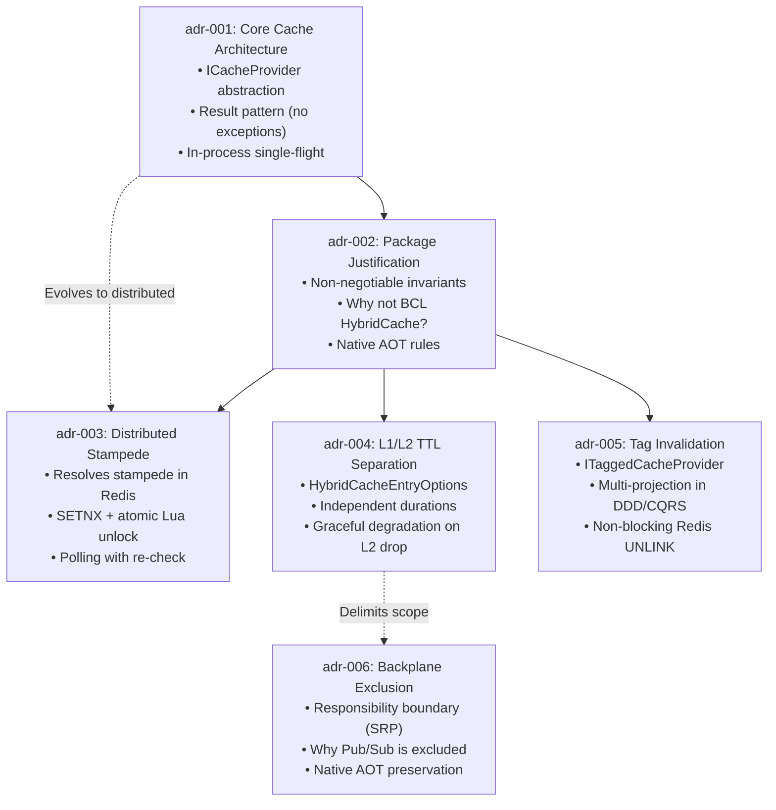

# Architecture Decision Records (ADR Index)

This directory contains the canonical **Architecture Decision Records (ADRs)** for `EricksonLopez.Caching`. Each decision documents context, evaluated alternatives, the adopted decision, and observable consequences across source code.

---

## 1. Causal Chain and Dependency Tree

The ADRs in this repository form a continuous causal progression:

---

## 2. Chronological and Sequential Index

| ADR | Title | Status | Date | Core Problem Solved |
|:---:|---|:---:|:---:|---|
| [**001**](./adr-001-cache-architecture.md) | **Cache Architecture & Functional Invariants** | `Accepted` | 2026-09-03 | Defines `ICacheProvider`, functional `Result<T>` control flow, and local single-flight using `SemaphoreSlim`. |
| [**002**](./adr-002-package-existence-justification.md) | **Package Existence & Invariant Justification** | `Accepted` | 2026-09-03 | Justifies autonomous existence vs .NET 9 `HybridCache` and establishes 7 non-negotiable invariants. |
| [**003**](./adr-003-distributed-stampede-protection.md) | **Distributed Stampede Protection Strategy** | `Accepted` | 2026-09-03 | Implements atomic multi-node distributed lock in Redis via `SETNX` with cryptographic tokens and Lua unlock. |
| [**004**](./adr-004-l1-l2-ttl-separation.md) | **L1/L2 TTL Separation & Graceful Degradation** | `Accepted` | 2026-09-03 | Introduces `HybridCacheEntryOptions` for independent RAM vs Redis durations and L2 fault resilience. |
| [**005**](./adr-005-tag-based-invalidation.md) | **Tag-Based Invalidation Strategy** | `Accepted` | 2026-09-03 | Introduces `ITaggedCacheProvider` to invalidate multi-projection denormalized views via Redis `UNLINK`. |
| [**006**](./adr-006-backplane-excluded-from-core.md) | **Exclusion of Redis Pub/Sub Backplane from Core** | `Accepted` | 2026-09-03 | Defines package boundaries: core excludes broadcasting Pub/Sub to preserve SRP and Native AOT. |

---

## 3. Record Conventions

1. **Continuous Local Numbering:** ADRs are strictly sequential and lowercase kebab-case (`adr-001-...`, `adr-002-...`).
2. **Immutability:** Accepted ADRs are immutable historical artifacts. Evolving decisions are captured in new ADRs explicitly superseding prior ones.
3. **Bidirectional Navigation:** Each record contains header and footer navigation links to previous and subsequent decisions.
