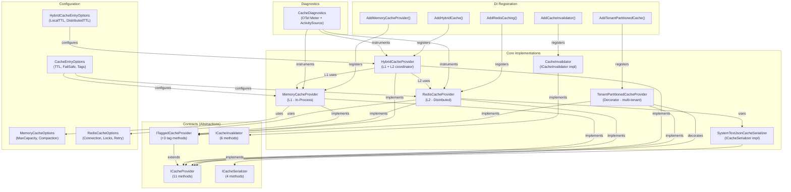
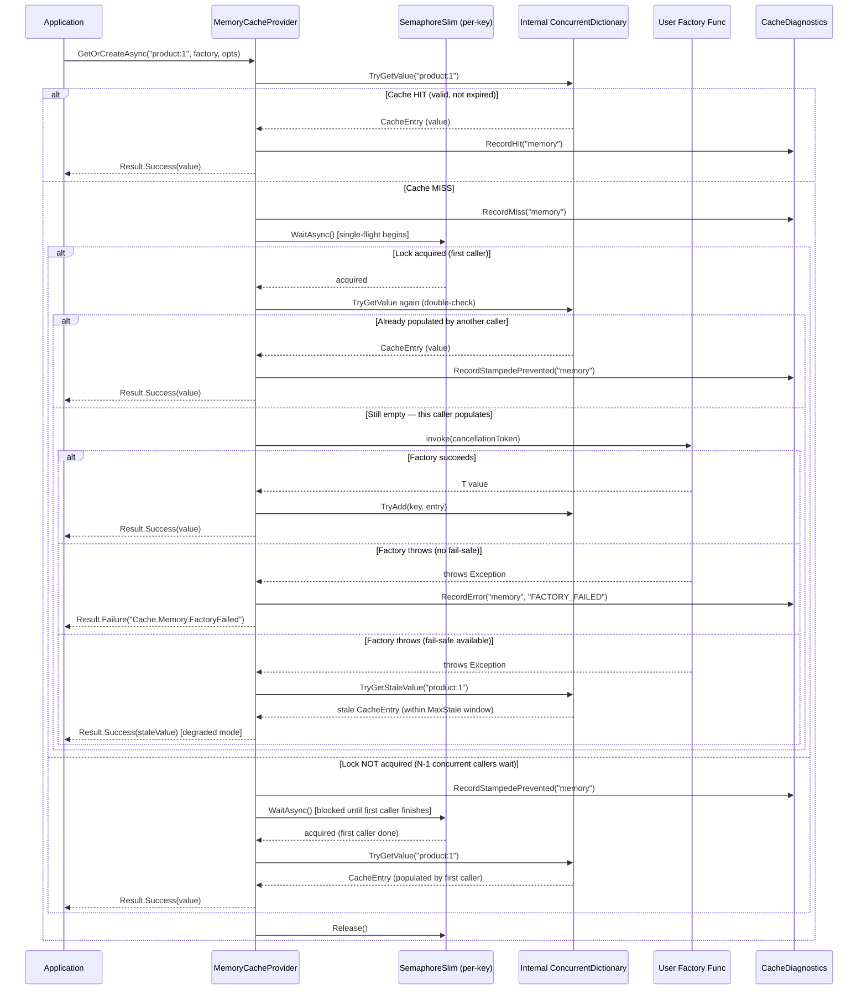
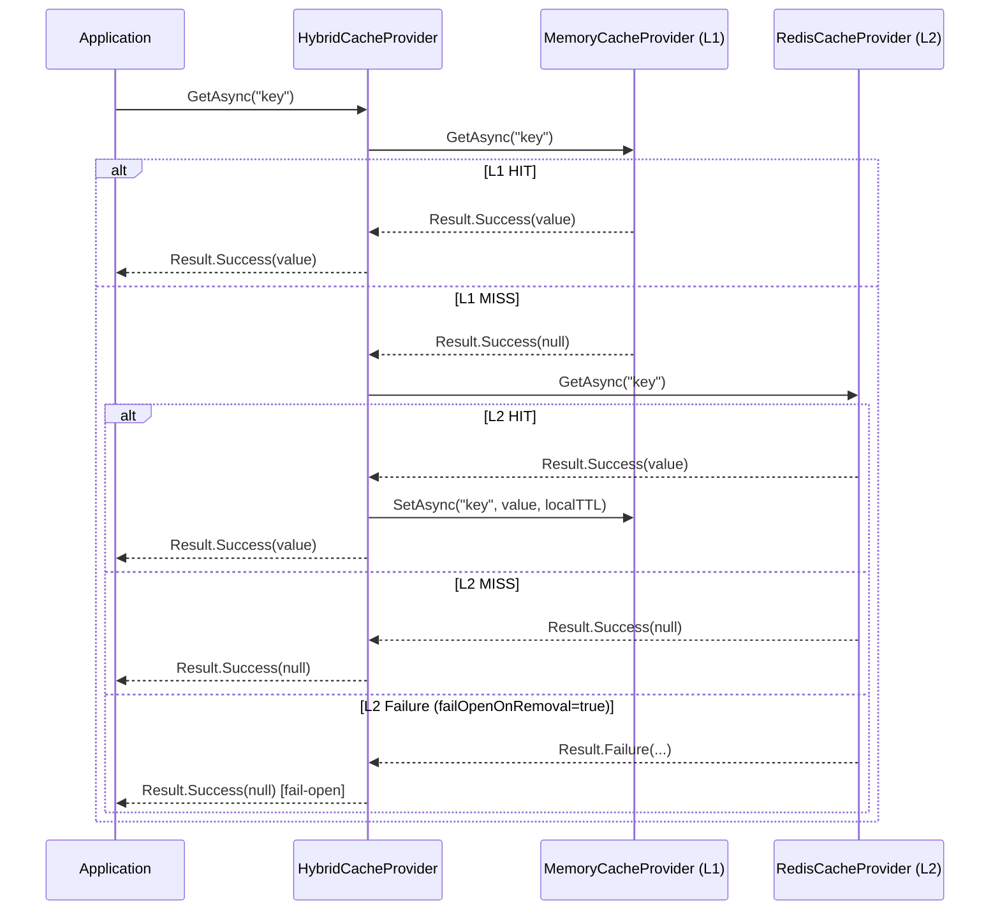
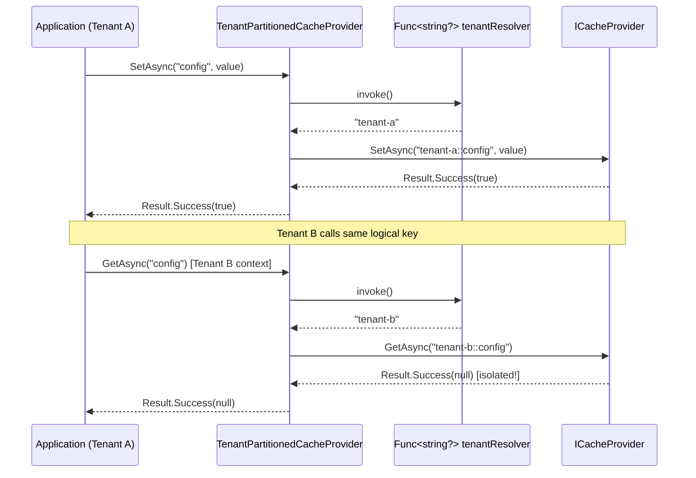
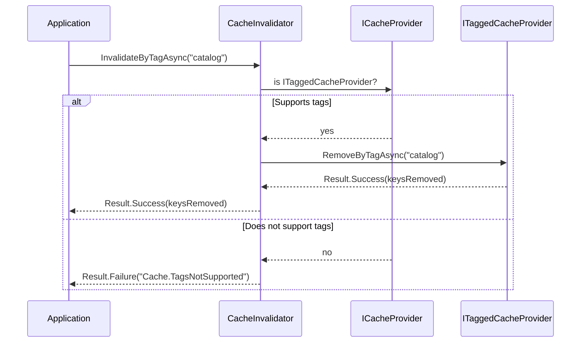
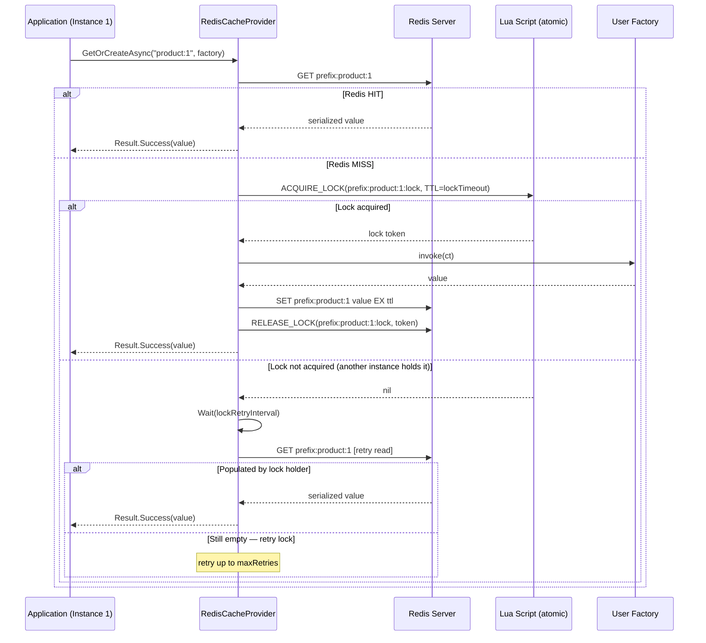
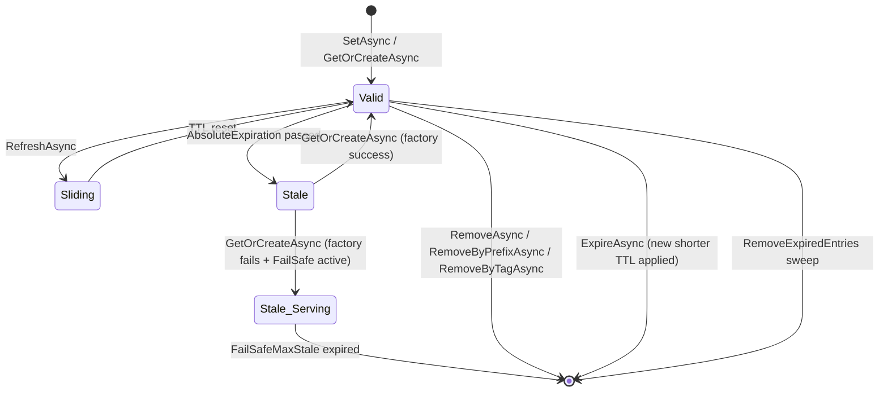
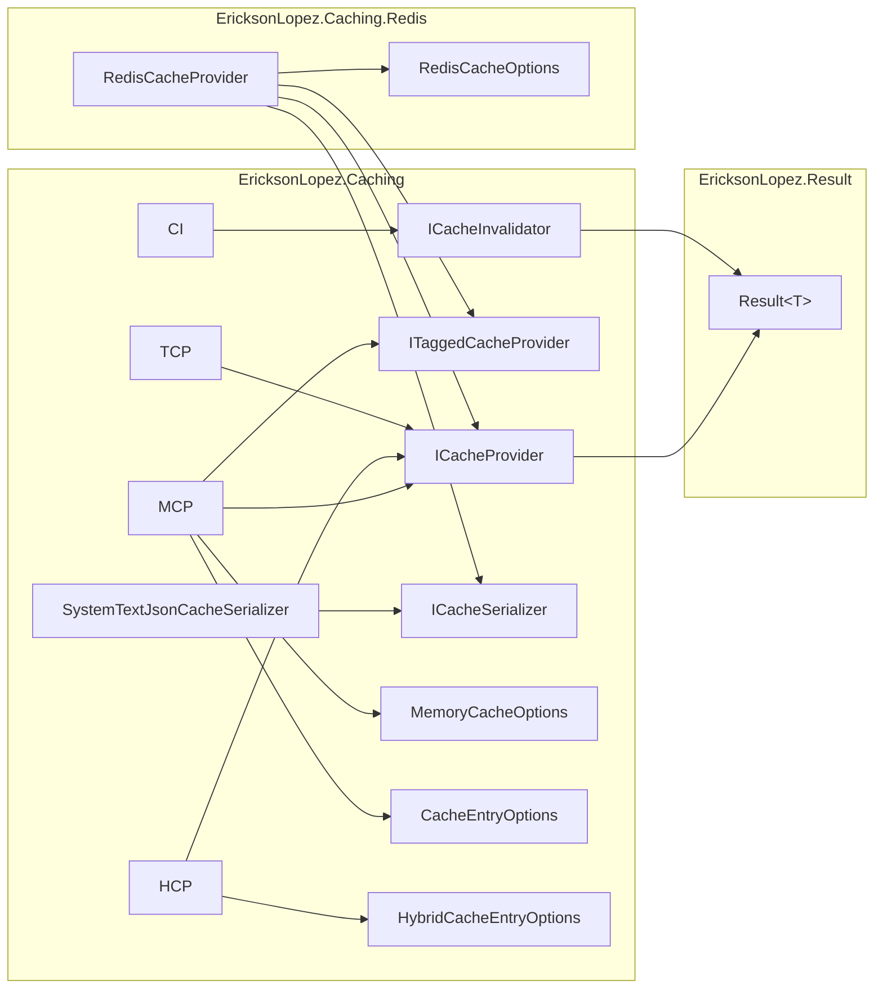
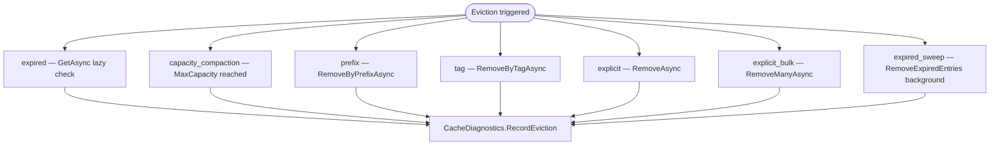

# System Functional Map

## Overall Architecture

---

## Primary Flow: GetOrCreateAsync (Stampede Protection)

---

## Flow: HybridCacheProvider — GetAsync

---

## Flow: TenantPartitionedCacheProvider — Key Resolution

---

## Flow: InvalidateByTagAsync

---

## Flow: RedisCacheProvider — Distributed Stampede Protection

---

## State Diagram: CacheEntry

---

## Component Dependency Diagram

---

## Eviction Reasons (MemoryCacheProvider)

